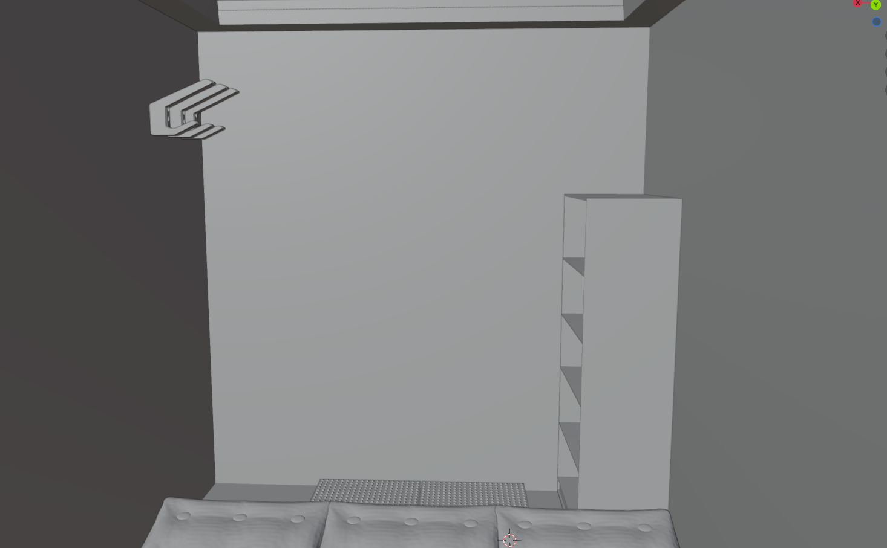

# Project Subterra Nova

Welkom in mijn zelfgemaakte ondergrondse oase, "SubterraNova" Deze prachtige ruimte is niet alleen een staaltje van mijn bouwkunst, maar ook een toevluchtsoord dat me ontsnapping biedt aan de dagelijkse drukte en me de gelegenheid geeft om te genieten van rust en creativiteit. Als de trotse bouwer van deze ondergrondse kamer, voel ik me bevoorrecht om de schoonheid en functionaliteit ervan met anderen te delen.

"SubterraNova" is meer dan alleen een ondergrondse kamer; het is een ontsnappingsplek waar ik mijn gedachten kan laten dwalen en mijn passies kan volgen. Het ruime ontwerp van 1,25 meter hoog, 1 meter breed en 2,5 meter lang biedt voldoende ruimte voor mij om te werken, te ontspannen en te dromen. De serene en rustgevende omgeving die de isolatie en waterdichte folie wrap creëren, zorgt voor een perfecte sfeer om mijn creativiteit de vrije loop te laten.

In "SubterraNova" vind je een harmonieuze mix van functionaliteit en comfort. Een elegant bureau is de plek waar ik mijn ideeën tot leven breng en mijn werk tot bloei laat komen. Na een lange dag van inspiratie en productiviteit, kan ik me op een comfortabele mat ontspannen en genieten van rustgevende momenten of een verkwikkende nachtrust. Met voldoende opbergruimte in de kast, kan ik mijn spullen netjes opbergen en mijn ruimte opgeruimd houden. De aanleg van elektriciteit zorgt voor een goed verlichte omgeving en maakt het mogelijk om mijn apparaten op te laden en te gebruiken, waardoor mijn creatieve sessies nog productiever worden. In "SubterraNova" voel ik me geïnspireerd, ontspannen en volledig in mijn element, en ik nodig je graag uit om de magie van deze ruimte te ervaren.

